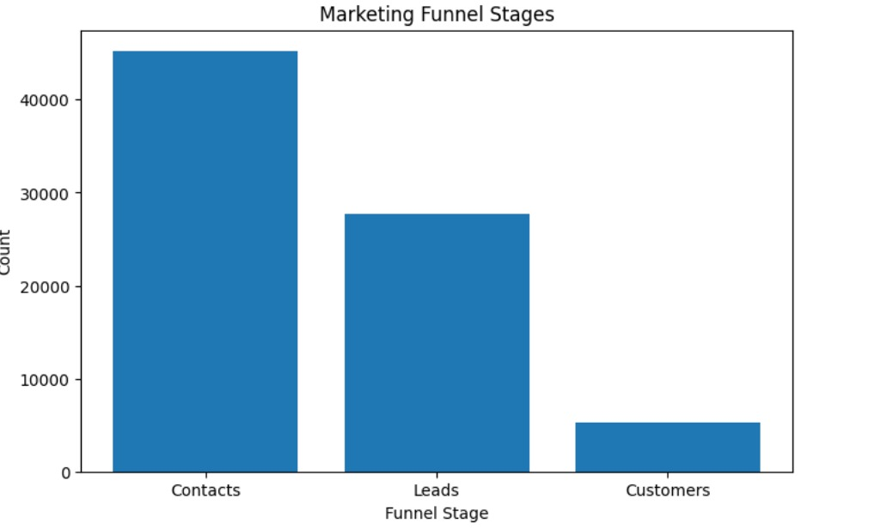
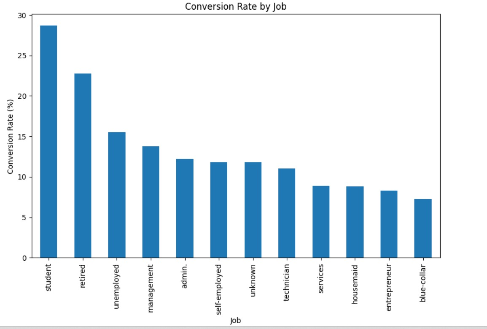
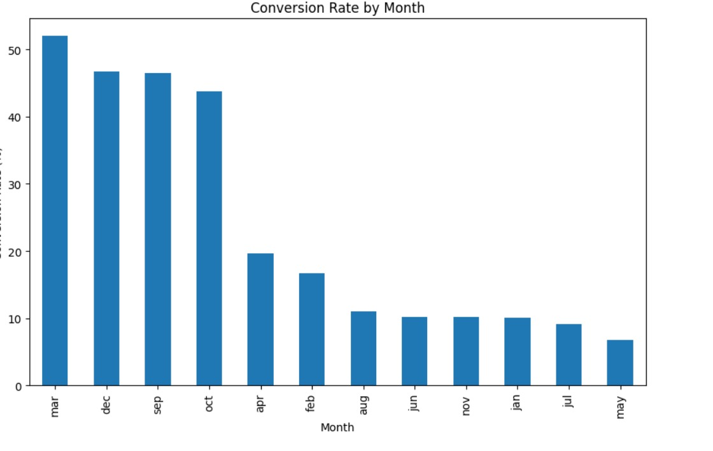

# 📊 Marketing Funnel & Conversion Performance Analysis

## 📌 Project Overview
This project analyzes a bank marketing campaign dataset to understand customer conversion behavior. The aim is to identify inefficiencies in the marketing funnel, evaluate performance across different customer segments, and provide actionable recommendations to improve conversion rates and overall campaign effectiveness.

## 🎯 Objective
- Analyze marketing funnel performance  
- Identify drop-off points in the customer journey  
- Measure conversion rates at each stage  
- Evaluate segment-wise performance  
- Provide data-driven business recommendations  

## 🛠 Tools & Technologies
- Python  
- Pandas  
- Matplotlib  
- Jupyter Notebook  

## 📂 Dataset
- **Bank Marketing Dataset (`bank-full.csv`)**  
- Contains customer demographics, campaign interactions, and subscription outcomes  

## 📊 Funnel Definition
- **Contacts** → Total customers contacted  
- **Leads** → Customers contacted more than once (`campaign > 1`)  
- **Customers** → Customers who subscribed (`y = yes`)  

## 📈 Key Metrics
- Contact → Lead Conversion Rate  
- Lead → Customer Conversion Rate  
- Funnel Drop-off Rate
- 
## 📸 Project Preview

### Marketing Funnel

### Job Conversion Analysis

### Monthly Performance

## 🔍 Key Insights
- A significant drop-off exists between total contacts and converted customers, indicating inefficiencies in the funnel.  
- Repeated contacts do not always improve conversion rates, suggesting diminishing returns.  
- Certain job categories show higher conversion rates, highlighting opportunities for better targeting.  
- Contact method significantly impacts campaign success.  
- Conversion performance varies across months, indicating the importance of campaign timing.  

## 💡 Recommendations
- Focus marketing efforts on high-converting customer segments.  
- Optimize outreach frequency to avoid over-contacting customers.  
- Prioritize the most effective communication channels.  
- Schedule campaigns during high-performing months.  
- Personalize marketing strategies based on customer profiles.  

## 📂 Project Workflow
1. Data Loading  
2. Data Cleaning  
3. Funnel Definition  
4. Conversion Analysis  
5. Drop-off Analysis  
6. Segment Analysis  
7. Insights & Recommendations  

## 🚀 Conclusion
This project demonstrates how data-driven analysis can uncover inefficiencies in marketing funnels and provide actionable insights to improve customer conversion rates and campaign effectiveness.

